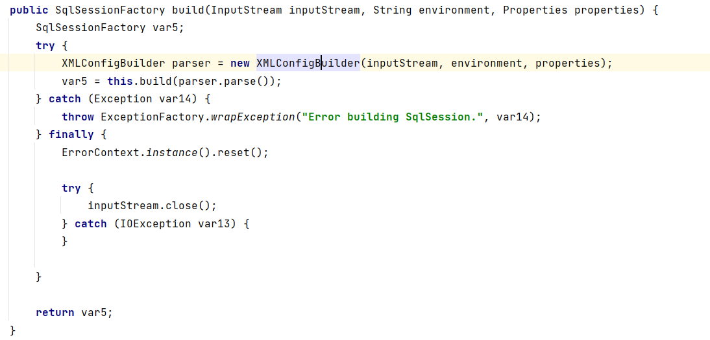
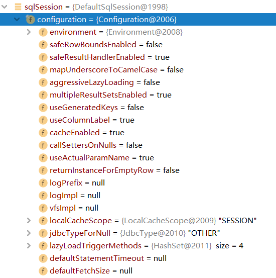
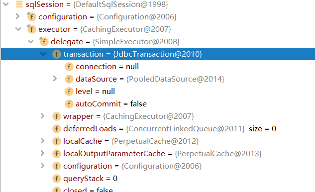
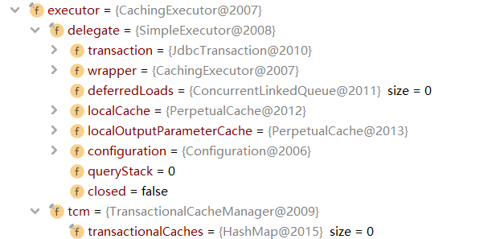

# Mybatis-Study
## 增删改查(mybatis-01)
### 0. 准备工作
创建mybatis数据库,创建user表，增加id,name,pwd三个字段，增加一些数据

工具类com/sicilly/utils/MybatisUtils.java
```java
package com.sicilly.utils;

import org.apache.ibatis.io.Resources;
import org.apache.ibatis.session.SqlSession;
import org.apache.ibatis.session.SqlSessionFactory;
import org.apache.ibatis.session.SqlSessionFactoryBuilder;

import java.io.IOException;
import java.io.InputStream;

public class MybatisUtils {
    private static SqlSessionFactory sqlSessionFactory;

    static {
        try {
            //使用mybatis第一步：获取sqlSessionFactory对象
            String resource = "mybatis-config.xml";
            InputStream inputStream = Resources.getResourceAsStream(resource);
            sqlSessionFactory = new SqlSessionFactoryBuilder().build(inputStream);
        } catch (IOException e) {
            e.printStackTrace();
        }
    }

    //既然有了 SqlSessionFactory，顾名思义，我们可以从中获得 SqlSession 的实例。SqlSession 提供了在数据库执行 SQL 命令所需的所有方法。
    // 你可以通过 SqlSession 实例来直接执行已映射的 SQL 语句

    public static SqlSession getSqlSession(){
        return sqlSessionFactory.openSession();
    }
}

```

实体类com/sicilly/pojo/User.java注意和数据表中字段一一对应
```java
package com.sicilly.pojo;

public class User {
    private int id;
    private String name;
    private String pwd;

    public User() {
    }

    public User(int id, String name, String pwd) {
        this.id = id;
        this.name = name;
        this.pwd = pwd;
    }

    public int getId() {
        return id;
    }

    public void setId(int id) {
        this.id = id;
    }

    public String getName() {
        return name;
    }

    public void setName(String name) {
        this.name = name;
    }

    public String getPwd() {
        return pwd;
    }

    public void setPwd(String pwd) {
        this.pwd = pwd;
    }

    @Override
    public String toString() {
        return "User{" +
                "id=" + id +
                ", name='" + name + '\'' +
                ", pwd='" + pwd + '\'' +
                '}';
    }
}

```

在pom.xml中引入mybatis、junit、mysql-connector-java的包
```java
<?xml version="1.0" encoding="UTF-8"?>
<project xmlns="http://maven.apache.org/POM/4.0.0"
         xmlns:xsi="http://www.w3.org/2001/XMLSchema-instance"
         xsi:schemaLocation="http://maven.apache.org/POM/4.0.0 http://maven.apache.org/xsd/maven-4.0.0.xsd">
    <modelVersion>4.0.0</modelVersion>


    <groupId>com.sicilly</groupId>
    <artifactId>Mybatis-Study</artifactId>
    <packaging>pom</packaging>
    <version>1.0-SNAPSHOT</version>
    <modules>
        <module>mybatis-01</module>
    </modules>


    <dependencies>

        <dependency>
            <groupId>mysql</groupId>
            <artifactId>mysql-connector-java</artifactId>
            <version>5.1.47</version>
        </dependency>

        <dependency>
            <groupId>org.mybatis</groupId>
            <artifactId>mybatis</artifactId>
            <version>3.5.2</version>
        </dependency>


        <dependency>
            <groupId>junit</groupId>
            <artifactId>junit</artifactId>
            <version>4.12</version>
        </dependency>
    </dependencies>


    <build>
        <resources>
            <resource>
                <directory>src/main/resources</directory>
                <includes>
                    <include>**/*.properties</include>
                    <include>**/*.xml</include>
                </includes>
            </resource>
            <resource>
                <directory>src/main/java</directory>
                <includes>
                    <include>**/*.properties</include>
                    <include>**/*.xml</include>
                </includes>
                <filtering>true</filtering>
            </resource>
        </resources>
    </build>

</project>
```
### 1. 第一个Mybatis程序(查询)
com/sicilly/dao/UserMapper.java  是一个接口
```java
package com.sicilly.dao;

import com.User;

import java.util.List;

public interface UserMapper {
    // 查询全部用户
    List<User> getUserList();
}

```
com/sicilly/dao/UserMapper.xml  绑定接口，在这里写sql语句
```xml
<?xml version="1.0" encoding="UTF-8" ?>
<!DOCTYPE mapper
        PUBLIC "-//mybatis.org//DTD Mapper 3.0//EN"
        "http://mybatis.org/dtd/mybatis-3-mapper.dtd">

<!--namespace绑定一个对应的Mapper接口-->
<mapper namespace="com.UserMapper">

<!--    查询语句 id就是对应的namespace中的方法名-->
<!--    resultType是sql语句执行的返回值-->
    <select id="getUserList" resultType="com.User">
        select * from mybatis.user
    </select>

</mapper>
```

### 2. 增删查改实现

#### 根据id查

UserMapper.java写接口

```java
package com.sicilly.dao;

import com.User;

import java.util.List;

public interface UserMapper {
    // 查询全部用户
    List<User> getUserList();

    // 根据ID查询用户
    User getUserById(int id);
}

```

UserMapper.xml 补充实现类 写sql

```xml
<?xml version="1.0" encoding="UTF-8" ?>
<!DOCTYPE mapper
        PUBLIC "-//mybatis.org//DTD Mapper 3.0//EN"
        "http://mybatis.org/dtd/mybatis-3-mapper.dtd">

<!--namespace绑定一个对应的Mapper接口-->
<mapper namespace="com.UserMapper">

    <select id="getUserById" parameterType="int" resultType="com.User">
        select * from mybatis.user where id=#{id}
    </select>

</mapper>
```

UserDaoTest.java 测试

```java
package com.sicilly.dao;

import com.User;
import com.MybatisUtils;
import org.apache.ibatis.session.SqlSession;
import org.junit.Test;

import java.util.List;

public class UserDaoTest {

    @Test
    public void getUserById(){
        // 第一步：获得sqlSession对象
        SqlSession sqlSession = MybatisUtils.getSqlSession();

        try {
            // 方式一：getMapper
            // 先获得userMapper接口里的对象
            UserMapper userMapper=sqlSession.getMapper(UserMapper.class);
            // 就可以执行对象里面的方法 查id为1的user
            User user=userMapper.getUserById(1);
            // 输出
            System.out.println(user);
        }finally {
            // 关闭sqlSession
            sqlSession.close();
        }

    }
}

```

#### 新增用户

UserMapper.java

这次要传入的是User对象而不是基本类型int了

```java
package com.sicilly.dao;

import com.User;

import java.util.List;

public interface UserMapper {
    // 查询全部用户
    List<User> getUserList();

    // 根据ID查询用户
    User getUserById(int id);

    // 新增用户 传入的是一个user对象
    int addUser(User user);
}

```


UserMapper.xml

注意如何取出对象中的属性

```xml
<?xml version="1.0" encoding="UTF-8" ?>
<!DOCTYPE mapper
        PUBLIC "-//mybatis.org//DTD Mapper 3.0//EN"
        "http://mybatis.org/dtd/mybatis-3-mapper.dtd">

<!--namespace绑定一个对应的Mapper接口-->
<mapper namespace="com.UserMapper">


<!--User对象中的属性，可以直接取出来-->
    <insert id="addUser" parameterType="com.User">
        insert into mybatis.user (id,name,pwd) values(#{id},#{name},#{pwd})
    </insert>

</mapper>
```


UserDaoTest.java

注意要提交事务！

```java
import java.util.List;

public class UserDaoTest {

    // 增删改需要提交事务
    @Test
    public void AddUser(){
        // 第一步：获得sqlSession对象
        SqlSession sqlSession = MybatisUtils.getSqlSession();

        try {
            // 方式一：getMapper
            // 先获得userMapper接口里的对象
            UserMapper userMapper=sqlSession.getMapper(UserMapper.class);
            // 就可以执行对象里面的方法 增加用户
            userMapper.addUser(new User(4,"jerry","654321"));
            // 提交事务
            sqlSession.commit();
        }finally {
            // 关闭sqlSession
            sqlSession.close();
        }

    }
}

```

#### 修改、删除用户

UserMapper.java

```java
package com.sicilly.dao;

import com.User;

import java.util.List;

public interface UserMapper {
    // 查询全部用户
    List<User> getUserList();

    // 根据ID查询用户
    User getUserById(int id);

    // 新增用户 传入的是一个user对象
    int addUser(User user);

    // 修改用户
    int updateUser(User user);
    
    // 删除用户
    int deleteUser(int id);
}
```

UserMapper.xml

```xml
<?xml version="1.0" encoding="UTF-8" ?>
<!DOCTYPE mapper
        PUBLIC "-//mybatis.org//DTD Mapper 3.0//EN"
        "http://mybatis.org/dtd/mybatis-3-mapper.dtd">

<!--namespace绑定一个对应的Mapper接口-->
<mapper namespace="com.UserMapper">

    <update id="updateUser" parameterType="com.User">
        update mybatis.user
        set name = #{name},pwd=#{pwd}
        where id=#{id};
    </update>
    
    <delete id="deleteUser" parameterType="int">
        delete
        from mybatis.user
        where id=#{id};

    </delete>    

</mapper>
```

UserDapTest.java

```java
package com.sicilly.dao;

import com.User;
import com.MybatisUtils;
import org.apache.ibatis.session.SqlSession;
import org.junit.Test;

import java.util.List;

public class UserDaoTest {

    @Test
    public void updateUser(){
        // 第一步：获得sqlSession对象
        SqlSession sqlSession = MybatisUtils.getSqlSession();

        try {
            // 方式一：getMapper
            // 先获得userMapper接口里的对象
            UserMapper userMapper=sqlSession.getMapper(UserMapper.class);
            // 就可以执行对象里面的方法 修改用户
            userMapper.updateUser(new User(4,"tom","333"));
            // 提交事务
            sqlSession.commit();
        }finally {
            // 关闭sqlSession
            sqlSession.close();
        }
    }
    
    @Test
    public void deleteUser(){
        // 第一步：获得sqlSession对象
        SqlSession sqlSession = MybatisUtils.getSqlSession();

        try {
            // 方式一：getMapper
            // 先获得userMapper接口里的对象
            UserMapper userMapper=sqlSession.getMapper(UserMapper.class);
            // 就可以执行对象里面的方法 删除用户
            userMapper.deleteUser(4);
            // 提交事务
            sqlSession.commit();
        }finally {
            // 关闭sqlSession
            sqlSession.close();
        }

    }
}

```

### 3. 用Map传递参数

对象传递参数，直接在sql中取对象的属性即可 `parameterType=“Object”`

只有一个基本类型参数的情况下，可以直接在sql中取到

多个参数可以用map或者注解（后面讲）传递参数，直接在sql中取出key即可 `parameterType=“map”`

UserMapper.java

```java
    // 使用map来传递参数
    int addUser2(Map<String,Object> map);
```

UserMapper.xml

```xml
    <insert id="addUser2" parameterType="map">
        insert into mybatis.user (id,name,pwd)
        values (#{id1}, #{name1}, #{pwd1});
    </insert>
```

UserDapTest.java

```java
    @Test
    public void AddUser2(){
        // 第一步：获得sqlSession对象
        SqlSession sqlSession = MybatisUtils.getSqlSession();

        try {
            // 方式一：getMapper
            // 先获得userMapper接口里的对象
            UserMapper userMapper=sqlSession.getMapper(UserMapper.class);
            // 准备一个万能的map
            Map<String,Object>map=new HashMap<String,Object>();
            map.put("id1",10);
            map.put("name1","dd");
            map.put("pwd1","123");
            // 把map放进userMapper
            userMapper.addUser2(map);

            // 提交事务
            sqlSession.commit();
        }finally {
            // 关闭sqlSession
            sqlSession.close();
        }

    }

```

## 配置解析(mybatis-02)

### 1. 核心配置文件

- mybatis-config.xml

```xml
configuration（配置）
    properties（属性）
    settings（设置）
    typeAliases（类型别名）
    typeHandlers（类型处理器）
    objectFactory（对象工厂）
    plugins（插件）
        environments（环境配置）
            environment（环境变量）
            transactionManager（事务管理器）
    dataSource（数据源）
    databaseIdProvider（数据库厂商标识）
    mappers（映射器）
```


### 2. 环境配置（environments）

 MyBatis 可以配置成适应多种环境 

 **不过要记住：尽管可以配置多个环境，但每个 SqlSessionFactory 实例只能选择一种环境。** 

Mybatis 默认的事务管理器是JDBC，连接池：POOLED


### 3. 属性

我们可以通过properties属性来引用配置文件

这些属性可以在外部进行配置，并可以进行动态替换。你既可以在典型的 Java 属性文件中配置这些属性，也可以在 properties 元素的子元素中设置。 （db.properties）

编写一个配置文件

db.properties

```properties
driver=com.mysql.jdbc.Driver
url=jdbc:mysql://localhost:3306/mybatis?userSSL=true&useUnicode=true&characterEncoding=UTF-8
username=root
password=
```

在核心配置文件中引入

mybatis-config.xml (同时有的话，优先走外面properties)

```xml
<?xml version="1.0" encoding="UTF-8" ?>
<!DOCTYPE configuration
        PUBLIC "-//mybatis.org//DTD Config 3.0//EN"
        "http://mybatis.org/dtd/mybatis-3-config.dtd">

<configuration>

    <!--引入外部配置文件-->
    <!--<properties resource="db.properties"/>-->

    <properties resource="db.properties">
        <property name="username" value="root"></property>
        <property name="password" value="hdk123"></property>
    </properties>

    <environments default="development">
        <environment id="development">
            <transactionManager type="JDBC"/>
            <dataSource type="POOLED">
                <property name="driver" value="${driver}"/>
                <property name="url" value="${url}"/>
                <property name="username" value="${username}"/>
                <property name="password" value="${password}"/>
            </dataSource>
        </environment>
    </environments>

    <!--每一个mapper.xml都需要注册-->
    <mappers>
        <mapper resource="com/sicilly/dao/UserMapper.xml"/>
    </mappers>

</configuration>
```


### 4. 类型别名（typeAliases）

 类型别名可为 Java 类型设置一个缩写名字。 

```xml
<typeAliases>
    <typeAlias type="com.User" alias="User"></typeAlias>
</typeAliases>
```

扫描实体类的包，默认别名就为这个类的类名首字母小写

```xml
<typeAliases>
    <package name="com.User"></package>
</typeAliases>
```

在实体类，比较少的时候使用第一种，实体类多使用第二种。

第一种可以自定义，第二则不行，但是 若有注解，则别名为其注解值 。

```java
@Alias("hello")
public class User {
}
```


### 5. 设置

| 设置名             | 描述                                                         | 有效值                                                       | 默认值 |
| :----------------- | :----------------------------------------------------------- | :----------------------------------------------------------- | :----- |
| cacheEnabled       | 全局性地开启或关闭所有映射器配置文件中已配置的任何缓存。     | true \| false                                                | true   |
| lazyLoadingEnabled | 延迟加载的全局开关。当开启时，所有关联对象都会延迟加载。 特定关联关系中可通过设置 `fetchType` 属性来覆盖该项的开关状态。 | true \| false                                                | false  |
| logImpl            | 指定 MyBatis 所用日志的具体实现，未指定时将自动查找。        | SLF4J \| LOG4J \| LOG4J2 \| JDK_LOGGING \| COMMONS_LOGGING \| STDOUT_LOGGING \| NO_LOGGING | 未设置 |

### 6. 其他

- [typeHandlers（类型处理器）](https://mybatis.org/mybatis-3/zh/configuration.html#typeHandlers)
- [objectFactory（对象工厂）](https://mybatis.org/mybatis-3/zh/configuration.html#objectFactory)
- [plugins（插件）](https://mybatis.org/mybatis-3/zh/configuration.html#plugins)
  - mybatis-generator-core
  - mybatis-plus
  - 通用mapper

### 7. 映射器

方式一: [推荐使用]

```xml
<mappers>
    <mapper resource="com/sicilly/dao/UserMapper.xml"/>
</mappers>
```

方式二：

```xml
<mappers>
    <mapper class="com.UserMapper" />
</mappers>
```

- 接口和它的Mapper必须同名
- 接口和他的Mapper必须在同一包下

方式三：

```xml
<mappers>
    <package name="com.sicilly.dao" />
</mappers>
```

- 接口和它的Mapper必须同名
- 接口和他的Mapper必须在同一包下

### 8.生命周期和作用域

作用域和生命周期类别是至关重要的，因为错误的使用会导致非常严重的**并发问题**。

**SqlSessionFactoryBuilder**: 

-  一旦创建了 SqlSessionFactory，就不再需要它了 。
- 局部变量

 **SqlSessionFactory**：

-  就是数据库连接池。
-  一旦被创建就应该在应用的运行期间一直存在 ，**没有任何理由丢弃它或重新创建另一个实例 。** 多次重建 SqlSessionFactory 被视为一种代码“坏习惯”。 
-  因此 SqlSessionFactory 的最佳作用域是应用作用域。 
-  最简单的就是使用单例模式或者静态单例模式。 

 **SqlSession**：

- 每个线程都应该有它自己的 SqlSession 实例。 
- 连接到连接池的请求！
-  SqlSession 的实例不是线程安全的，因此是不能被共享的 ，所以它的最佳的作用域是请求或方法作用域。 
- 用完之后赶紧关闭，否则资源被占用。

## 结果集映射(mybatis-03)

### 1. 问题

**属性名和字段名不一致的问题**

数据库中的字段---- pwd

实体类字段-----password

User

```java
package com.sicilly.pogo;

public class User {

    private int id;
    private String name;
    private String password;
}
```

运行结果：

> User{id=2, name='wang', password='null'}


### 2. 解决方法

核心配置文件

- 起别名

```xml
<select id="getUserById" resultType="User"
    parameterType="int">
        select id,name,pwd as password from mybatis.user where id = #{id}
</select>
```

- resultMap 结果集映射

```xml
<?xml version="1.0" encoding="UTF-8" ?>
<!DOCTYPE mapper
        PUBLIC "-//mybatis.org//DTD Mapper 3.0//EN"
        "http://mybatis.org/dtd/mybatis-3-mapper.dtd">
<mapper namespace="com.UserMapper">

	<!-- resultMap结果集映射-->
    <resultMap id="UserMap" type="User">
        
		<!-- column数据库中的字段，property实体类中的属性-->
        <result column="id" property="id"></result>
        <result column="name" property="name"></result>
        <result column="pwd" property="password"></result>
        
    </resultMap>
    
	<!-- 使用resultMap属性-->
    <select id="getUserList" resultMap="UserMap">
        select * from mybatis.user
    </select>

</mapper>
```

- `resultMap` 元素是 MyBatis 中最重要最强大的元素。 

- ResultMap 的设计思想是，对简单的语句做到零配置，对于复杂一点的语句，只需要描述语句之间的关系就行了。 

```xml
<resultMap id="UserMap" type="User">
    <!--colunm 数据库中的字段，property实体中的属性-->
    <!--<result column="id" property="id"></result>-->
    <!--<result column="name" property="name"></result>-->
    <result column="pwd" property="password"></result>
</resultMap>
```

## 日志(mybatis-04)

### 1. 日志工厂

如果一个数据库操作出现了异常，我们需要排错。日志就是最好的助手。

曾经：sout，debug

现在：日志工厂

 logImpl 

- SLF4J 
- LOG4J [掌握]
- LOG4J2 
- JDK_LOGGING 
- COMMONS_LOGGING 
- STDOUT_LOGGING [掌握]
- NO_LOGGING 

具体使用哪一个，在设置中设定

STDOUT_LOGGING 标志日志输出

mybatis-config.xml中

```xml
<settings>
    <setting name="logImpl" value="STDOUT_LOGGING"/>
</settings>
```

控制台输出：

```
Opening JDBC Connection
Tue Mar 29 13:53:05 CST 2022 WARN: Establishing SSL connection without server's identity verification is not recommended. According to MySQL 5.5.45+, 5.6.26+ and 5.7.6+ requirements SSL connection must be established by default if explicit option isn't set. For compliance with existing applications not using SSL the verifyServerCertificate property is set to 'false'. You need either to explicitly disable SSL by setting useSSL=false, or set useSSL=true and provide truststore for server certificate verification.
Created connection 2067925017.
Setting autocommit to false on JDBC Connection [com.mysql.jdbc.JDBC4Connection@7b420819]
==>  Preparing: select * from mybatis.user 
==> Parameters: 
<==    Columns: id, name, pwd
<==        Row: 1, bobo, 123456
<==        Row: 2, 张三, 123456
<==        Row: 3, 李四, 123456
<==        Row: 10, dd, 123
<==      Total: 4
User{id=1, name='bobo', password='123456'}
User{id=2, name='张三', password='123456'}
User{id=3, name='李四', password='123456'}
User{id=10, name='dd', password='123'}
Resetting autocommit to true on JDBC Connection [com.mysql.jdbc.JDBC4Connection@7b420819]
Closing JDBC Connection [com.mysql.jdbc.JDBC4Connection@7b420819]
Returned connection 2067925017 to pool.
```

### 2. Log4j

1. 先导包

pom.xml下

```xml
<dependencies>
    <!-- https://mvnrepository.com/artifact/log4j/log4j -->
    <dependency>
        <groupId>log4j</groupId>
        <artifactId>log4j</artifactId>
        <version>1.2.17</version>
    </dependency>
</dependencies>
```
2. 新建log4j.properties文件

```properties
### set log levels ###
log4j.rootLogger = DEBUG,console,file

### 输出到控制台 ###
log4j.appender.console = org.apache.log4j.ConsoleAppender
log4j.appender.console.Target = System.out
log4j.appender.console.Threshold = DEBUG
log4j.appender.console.layout = org.apache.log4j.PatternLayout
log4j.appender.console.layout.ConversionPattern = [%c]-%m%n

### 输出到日志文件 ###
log4j.appender.file=org.apache.log4j.RollingFileAppender
log4j.appender.file.File=./log/sicilly.log
log4j.appender.file.MaxFileSize=10mb 
log4j.appender.file.Threshold=DEBUG 
log4j.appender.file.layout=org.apache.log4j.PatternLayout
log4j.appender.file.layout.ConversionPattern=[%p][%d{yy-MM-dd}][%c]%m%n

# 日志输出级别
log4j.logger.org.mybatis=DEBUG
log4j.logger.java.sql=DEBUG
log4j.logger.java.sql.Statement=DEBUG
log4j.logger.java.sql.ResultSet=DEBUG
log4j.logger.java.sql.PreparedStatement=DEBUG
```

3. 配置实现

```xml
<settings>
    <setting name="logImpl" value="LOG4J"/>
</settings>
```

4. Log4j使用

```java
package com.sicilly.dao;

import com.sicilly.pojo.User;
import com.sicilly.utils.MybatisUtils;
import org.apache.ibatis.session.SqlSession;
import org.apache.log4j.Logger;
import org.junit.Test;

public class UserDaoTest {

    static Logger logger = Logger.getLogger(UserDaoTest.class);

    @Test
    public void test(){
        // 获得sqlsession对象
        SqlSession sqlSession = MybatisUtils.getSqlSession();
        try{
            // 1.执行 getmapper
            UserMapper userDao = sqlSession.getMapper(UserMapper.class);
            logger.info("测试");
            User user = userDao.getUserById(2);
            System.out.println(user);
        }catch(Exception e){
            e.printStackTrace();
        }finally{
            //关闭
            sqlSession.close();
        }
    }

    @Test
    public void testLog4j(){
        logger.info("info:进入了testlog4j");
        logger.debug("debug:进入了testlog4j");
        logger.error("error:进入了testlog4j");
    }

}
```

## 分页(mybatis-04)

### 1. Limit 分页

语法：

```sql
SELECT * from user limit startIndex,pageSize;
SELECT * from user limit 0,2;
```

UserMapper

```java
package com.sicilly.dao;

import com.sicilly.pojo.User;

import java.util.List;
import java.util.Map;

public interface UserMapper {

    //根据id查询用户
    User getUserById(int id);

    List<User> getUserByLimit(Map<String, Integer> map);

}

```

xml

```xml
<?xml version="1.0" encoding="UTF-8" ?>
<!DOCTYPE mapper
        PUBLIC "-//mybatis.org//DTD Mapper 3.0//EN"
        "http://mybatis.org/dtd/mybatis-3-mapper.dtd">
<!--namespace绑定一个对应的mapper接口-->
<mapper namespace="com.sicilly.dao.UserMapper">

    <select id="getUserById" resultMap="UserMap"
    parameterType="int">
        select * from mybatis.user where id = #{id}
    </select>

    <!--结果集映射-->
    <resultMap id="UserMap" type="User">
        <!--colunm 数据库中的字段，property实体中的属性-->
        <!--<result column="id" property="id"></result>-->
        <!--<result column="name" property="name"></result>-->
        <result column="pwd" property="password"></result>
    </resultMap>

    <select id="getUserByLimit" parameterType="map"
            resultType="User" resultMap="UserMap">
      select * from mybatis.user limit #{startIndex},#{pageSize}
    </select>

</mapper>
```

test类

```java
@Test
public void getByLimit(){
    SqlSession sqlSession = MybatisUtils.getSqlSession();
    UserMapper mapper = sqlSession.getMapper(UserMapper.class);
    Map<String, Integer> map = new HashMap<String, Integer>();
    map.put("startIndex", 1);
    map.put("pageSize", 2);
    List<User> userList = mapper.getUserByLimit(map);

    for(User user:userList){
        System.out.println(user);
    }

    sqlSession.close();
}
```


### 2. RowBounds分页

@Test

```java
@Test
public void getUserByRow(){
    SqlSession sqlSession = MybatisUtils.getSqlSession();
    //RowBounds实现
    RowBounds rowBounds = new RowBounds(1, 2);

    //通过java代码层面
    List<User> userList = sqlSession.selectList
        ("com.sicilly.dao.UserMapper.getUserByRowBounds",
         null,rowBounds);

    for (User user : userList) {
        System.out.println(user);
    }

    sqlSession.close();
}
```

### 3. 分页插件

[pageHelper]: https://pagehelper.github.io/


## 使用注解开发(mybatis-05)

1. 删除 UserMapper.xml

2. UserMapper

   注解在接口上实现

   ```java
   package com.sicilly.dao;
   
   import com.sicilly.pojo.User;
   import org.apache.ibatis.annotations.Select;
   
   import java.util.List;
   
   public interface UserMapper {
   
       @Select("select * from user")
       List<User> getUsers();
   }
   ```

3. 核心配置 mybatis-config.xml

   ```xml
   <?xml version="1.0" encoding="UTF-8" ?>
   <!DOCTYPE configuration
           PUBLIC "-//mybatis.org//DTD Config 3.0//EN"
           "http://mybatis.org/dtd/mybatis-3-config.dtd">
   
   <configuration>
   
       <!--引入外部配置文件-->
       <properties resource="db.properties"/>
   
       <!--可以给实体类起别名-->
       <typeAliases>
           <typeAlias type="com.sicilly.pojo.User" alias="User"></typeAlias>
       </typeAliases>
   
       <environments default="development">
           <environment id="development">
               <transactionManager type="JDBC"/>
               <dataSource type="POOLED">
                   <property name="driver" value="${driver}"/>
                   <property name="url" value="${url}"/>
                   <property name="username" value="${username}"/>
                   <property name="password" value="${password}"/>
               </dataSource>
           </environment>
       </environments>
   
       <!--绑定接口-->
       <mappers>
           <mapper class="com.sicilly.dao.UserMapper"></mapper>
       </mappers>
   </configuration>
   ```

   本质：反射机制

   底层：动态代理！
   
   

### 1. Mybatis详细执行流程

1. Resource获取全局配置文件

   ```java
   String resource = "mybatis-config.xml";
   InputStream inputStream = Resources.getResourceAsStream(resource);
   ```

2. 实例化SqlsessionFactoryBuilder

   ```java
   sqlSessionFactory = new SqlSessionFactoryBuilder().build(inputStream);
   ```

3. 解析配置文件流XMLConfigBuilder



4. Configration所有的配置信息

   

5. SqlSessionFactory实例化

   ```
   sqlSessionFactory = new SqlSessionFactoryBuilder().build(inputStream);
   ```

6. trasactional事务管理

   

7. 创建executor执行器

   

8. 创建SqlSession

   ```
   SqlSession sqlSession = MybatisUtils.getSqlSession();
   ```

   

9. 实现CRUD

   ```
   UserMapper userMaper = sqlSession.getMapper(UserMapper.class);
   List<User> users= userMaper.getUsers();
   ```

10. 查看是否执行成功

    

11. 提交事务

    

12. 关闭

```
sqlSession.close();
```

### 2. 注解CRUD

```java
package com.sicilly.dao;

import com.sicilly.pojo.User;
import org.apache.ibatis.annotations.*;

import java.util.List;

public interface UserMapper {

    @Select("select * from user")
    List<User> getUsers();

    //方法存在多个参数，所有的参数必须加@Param
    @Select("select * from user where id = #{id}")
    User getUserById(@Param("id") int id);

    @Insert("insert into user (id, name, pwd) values" +
            "(#{id},#{name},#{password})")
    int addUser(User user);

    @Update("update user set name=#{name}, pwd=#{password} " +
            "where id=#{id}")
    int updateUser(User user);

    @Delete("delete from user where id=#{id}")
    int deleteUser(@Param("id") int id);

}
```

MybatisUtils

```java
package com.sicilly.utils;

import org.apache.ibatis.io.Resources;
import org.apache.ibatis.session.SqlSession;
import org.apache.ibatis.session.SqlSessionFactory;
import org.apache.ibatis.session.SqlSessionFactoryBuilder;

import java.io.IOException;
import java.io.InputStream;

//sqlSessionFactory --> sqlSession
public class MybatisUtils {

    private static SqlSessionFactory sqlSessionFactory;

    static {
        try {
            //使用mybatis第一步：获取sqlSessionFactory对象
            String resource = "mybatis-config.xml";
            InputStream inputStream = Resources.getResourceAsStream(resource);
            sqlSessionFactory = new SqlSessionFactoryBuilder().build(inputStream);
        } catch (IOException e) {
            e.printStackTrace();
        }
    }

    public static SqlSession getSqlSession(){
        return sqlSessionFactory.openSession(true);
    }

}
```

Test

```java
package com.sicilly.dao;

import com.sicilly.pojo.User;
import com.sicilly.utils.MybatisUtils;
import org.apache.ibatis.session.SqlSession;
import org.junit.Test;

import java.util.List;

public class UserDaoTest {

    @Test
    public void test(){
        // 获得sqlsession对象
        SqlSession sqlSession = MybatisUtils.getSqlSession();
        try{
            // 1.执行 getmapper
            UserMapper userDao = sqlSession.getMapper(UserMapper.class);
            List<User> userList = userDao.getUsers();
            for (User user : userList) {
                System.out.println(user);
            }

        }catch(Exception e){
            e.printStackTrace();
        }finally{
            //关闭
            sqlSession.close();
        }
    }

    @Test
    public void getuserById(){
        // 获得sqlsession对象
        SqlSession sqlSession = MybatisUtils.getSqlSession();
        try{
            // 1.执行 getmapper
            UserMapper userDao = sqlSession.getMapper(UserMapper.class);
            User user = userDao.getUserById(1);

            System.out.println(user);


        }catch(Exception e){
            e.printStackTrace();
        }finally{
            //关闭
            sqlSession.close();
        }
    }

    @Test
    public void addUser(){
        // 获得sqlsession对象
        SqlSession sqlSession = MybatisUtils.getSqlSession();
        try{
            // 1.执行 getmapper
            UserMapper userDao = sqlSession.getMapper(UserMapper.class);
            userDao.addUser(new User(6, "kun","123"));

        }catch(Exception e){
            e.printStackTrace();
        }finally{
            //关闭
            sqlSession.close();
        }
    }

    @Test
    public void updateUser(){
        // 获得sqlsession对象
        SqlSession sqlSession = MybatisUtils.getSqlSession();
        try{
            // 1.执行 getmapper
            UserMapper userDao = sqlSession.getMapper(UserMapper.class);
            userDao.updateUser(new User(6, "fang","123"));

        }catch(Exception e){
            e.printStackTrace();
        }finally{
            //关闭
            sqlSession.close();
        }
    }

    @Test
    public void deleteUser(){
        // 获得sqlsession对象
        SqlSession sqlSession = MybatisUtils.getSqlSession();
        try{
            // 1.执行 getmapper
            UserMapper userDao = sqlSession.getMapper(UserMapper.class);
            userDao.deleteUser(6);

        }catch(Exception e){
            e.printStackTrace();
        }finally{
            //关闭
            sqlSession.close();
        }
    }
}
```

### 3. Lombok

在IDEA中安装lombok插件

配置

   ```xml
   <dependencies>
       <!-- https://mvnrepository.com/artifact/org.projectlombok/lombok -->
       <dependency>
           <groupId>org.projectlombok</groupId>
           <artifactId>lombok</artifactId>
           <version>1.18.12</version>
       </dependency>
   </dependencies>
   ```

 ```
   @Getter and @Setter
   @FieldNameConstants
   @ToString
   @EqualsAndHashCode
   @AllArgsConstructor, @RequiredArgsConstructor and @NoArgsConstructor
   @Log, @Log4j, @Log4j2, @Slf4j, @XSlf4j, @CommonsLog, @JBossLog, @Flogger, @CustomLog
   @Data
   @Builder
   @SuperBuilder
   @Singular
   @Delegate
   @Value
   @Accessors
   @Wither
   @With
   @SneakyThrows
 ```

   @Data: 无参构造，get，set，toString，hashCode

   在实体类上加注解

   ```java
   package com.sicilly.pojo;
   
   import lombok.AllArgsConstructor;
   import lombok.Data;
   import lombok.NoArgsConstructor;
   
   @Data
   @AllArgsConstructor
   @NoArgsConstructor
   public class User {
   
       private int id;
       private String name;
       private String password;
   
   }
   ```

## 多对一处理（mybatis-06）

sql语句：

```sql
CREATE TABLE `teacher` (
  `id` INT(10) NOT NULL,
  `name` VARCHAR(30) DEFAULT NULL,
  PRIMARY KEY (`id`)
) ENGINE=INNODB DEFAULT CHARSET=utf8;

INSERT INTO teacher(`id`, `name`) VALUES (1, '秦老师'); 

CREATE TABLE `student` (
  `id` INT(10) NOT NULL,
  `name` VARCHAR(30) DEFAULT NULL,
  `tid` INT(10) DEFAULT NULL,
  PRIMARY KEY (`id`),
  KEY `fktid` (`tid`),
  CONSTRAINT `fktid` FOREIGN KEY (`tid`) REFERENCES `teacher` (`id`)
) ENGINE=INNODB DEFAULT CHARSET=utf8;

INSERT INTO `student` (`id`, `name`, `tid`) VALUES ('1', '小明', '1'); 
INSERT INTO `student` (`id`, `name`, `tid`) VALUES ('2', '小红', '1'); 
INSERT INTO `student` (`id`, `name`, `tid`) VALUES ('3', '小张', '1'); 
INSERT INTO `student` (`id`, `name`, `tid`) VALUES ('4', '小李', '1'); 
INSERT INTO `student` (`id`, `name`, `tid`) VALUES ('5', '小王', '1');
```

### 1. 测试环境搭建

1. 导入lombok
2. 新建实体类Teacher，Student
3. 建立Mapper接口
4. 建立Mapper.xml文件
5. 在核心配置文件中绑定注册mapper接口
6. 测试查询能否成功


sql查询所有学生及其对应的老师：

```sql
select s.id,s.name,t.name from student s,teacher t where s.tid=t.id;
```

| id   | name | name   |
| ---- | ---- | ------ |
| 1    | 小明 | 秦老师 |
| 2    | 小红 | 秦老师 |
| 3    | 小张 | 秦老师 |

那在代码中要怎么写？

### 2. 按照查询嵌套处理

StudentMapper.java接口：

```java
package com.sicilly.dao;

import com.sicilly.pojo.Student;

import java.util.List;

public interface StudentMapper {
    // 查询所有学生信息，以及对应老师的信息
    public List<Student> getStudent();
}
			
```

StudentMapper.xml：

```java
<?xml version="1.0" encoding="UTF-8" ?>
<!DOCTYPE mapper
        PUBLIC "-//mybatis.org//DTD Config 3.0//EN"
        "http://mybatis.org/dtd/mybatis-3-mapper.dtd">

<mapper namespace="com.sicilly.dao.StudentMapper">
    <!--
    思路：
    1. 查询所有学生的信息
    2. 根据查询出来的学生tid，寻找对应的老师
    -->
    <select id="getStudent" resultMap="StudentTeacher">
        select * from student;
    </select>

    <resultMap id="StudentTeacher" type="Student">
        <!--复杂的属性需要单独处理，对象：association 集合：collection-->
        <association property="teacher" column="tid" javaType="Teacher" select="getTeacher"></association>
    </resultMap>

    <select id="getTeacher" resultType="Teacher">
        select * from teacher where id=#{id}
    </select>
</mapper>
```

MyTest：

```java
import com.sicilly.dao.StudentMapper;
import com.sicilly.dao.TeacherMapper;
import com.sicilly.pojo.Student;
import com.sicilly.pojo.Teacher;
import com.sicilly.utils.MybatisUtils;
import org.apache.ibatis.session.SqlSession;
import org.junit.Test;

import java.util.List;

public class MyTest {
    public static void main(String[] args) {
        SqlSession sqlSession= MybatisUtils.getSqlSession();
        TeacherMapper mapper = sqlSession.getMapper(TeacherMapper.class);
        Teacher teacher = mapper.getTeacher(1);
        System.out.println(teacher);
        sqlSession.close();
    }

    @Test
    public void testStudent(){
        SqlSession sqlSession= MybatisUtils.getSqlSession();
        StudentMapper mapper = sqlSession.getMapper(StudentMapper.class);
        List<Student> studentList = mapper.getStudent();
        for (Student student : studentList) {
            System.out.println(student);
        }
        sqlSession.close();
    }
}


```

查出来的结果：

```
Student(id=1, name=小明, teacher=Teacher(id=1, name=秦老师))
Student(id=2, name=小红, teacher=Teacher(id=1, name=秦老师))
Student(id=3, name=小张, teacher=Teacher(id=1, name=秦老师))
Student(id=4, name=小李, teacher=Teacher(id=1, name=秦老师))
Student(id=5, name=小王, teacher=Teacher(id=1, name=秦老师))
```

### 3. 按照结果嵌套处理

StudentMapper.xml：

```java
    <!--按照结果嵌套处理-->
    <select id="getStudent2" resultMap="StudentTeacher2">
        select s.id sid,s.name sname,t.name tname from student s,teacher t where s.tid=t.id;
    </select>

    <resultMap id="StudentTeacher2" type="Student">
        <association property="teacher" javaType="Teacher">
            <result property="name" column="tname"/>
        </association>
    </resultMap>
```

## 一对多处理(mybatis-07)

一个老师拥有多个学生，是一对多的关系

### 1. 测试环境搭建

实体类 

Student

```java
package com.sicilly.pojo;

import lombok.Data;

@Data
public class Student {
    private int id;
    private String name;
    private int tid;
}

```

Teacher

```java
package com.sicilly.pojo;
import lombok.Data;

import java.util.List;

@Data
public class Teacher {
    private int id;
    private String name;
    // 一个老师拥有多个学生
    private List<Student> students;
}

```

TeacherMapper接口

```java
package com.sicilly.dao;

import com.sicilly.pojo.Teacher;
import org.apache.ibatis.annotations.Param;
import org.apache.ibatis.annotations.Select;

import java.util.List;

public interface TeacherMapper {
    // 获取老师
    List<Teacher> getTeacher();
}

```

TeacherMapper.xml写sql

```xml
<?xml version="1.0" encoding="UTF-8" ?>
<!DOCTYPE mapper
        PUBLIC "-//mybatis.org//DTD Config 3.0//EN"
        "http://mybatis.org/dtd/mybatis-3-mapper.dtd">

<mapper namespace="com.sicilly.dao.TeacherMapper">
    <select id="getTeacher" resultType="Teacher">
        select * from mybatis.teacher;
    </select>
</mapper>
```

核心配置文件mybatis-config.xml 绑定接口

```xml
<?xml version="1.0" encoding="UTF-8" ?>
<!DOCTYPE configuration
        PUBLIC "-//mybatis.org//DTD Config 3.0//EN"
        "http://mybatis.org/dtd/mybatis-3-config.dtd">
<!--核心配置文件-->
<configuration>
    <properties resource="db.properties"/>

    <!--可以给实体类起别名-->
    <typeAliases>
    <!--typeAlias type="com.User" alias="User"/>-->
        <package name="com.sicilly.pojo"/>
    </typeAliases>
    <environments default="development">
        <environment id="development">
            <transactionManager type="JDBC"/>
            <dataSource type="POOLED">
                <property name="driver" value="${driver}"/>
                <property name="url" value="${url}"/>
                <property name="username" value="${username}"/>
                <property name="password" value="${password}"/>
            </dataSource>
        </environment>
    </environments>
    <!--绑定接口-->
    <mappers>
        <mapper class="com.sicilly.dao.TeacherMapper"/>
        <mapper class="com.sicilly.dao.StudentMapper"/>
    </mappers>
</configuration>
```

MyTest

```java
import com.sicilly.dao.TeacherMapper;
import com.sicilly.pojo.Teacher;
import com.sicilly.utils.MybatisUtils;
import org.apache.ibatis.session.SqlSession;
import org.junit.Test;

import java.util.List;

public class MyTest {
    @Test
    public void test(){
        SqlSession sqlSession = MybatisUtils.getSqlSession();
        TeacherMapper mapper = sqlSession.getMapper(TeacherMapper.class);
        List<Teacher> teachers = mapper.getTeacher();
        for (Teacher teacher : teachers) {
            System.out.println(teacher);
        }
        sqlSession.close();
    }
}
```

查询结果：

```
Teacher(id=1, name=秦老师, students=null)
```

接下来要解决students=null的问题

### 2.按结果嵌套处理

TeacherMapper.xml

```xml
<?xml version="1.0" encoding="UTF-8" ?>
<!DOCTYPE mapper
        PUBLIC "-//mybatis.org//DTD Config 3.0//EN"
        "http://mybatis.org/dtd/mybatis-3-mapper.dtd">

<mapper namespace="com.sicilly.dao.TeacherMapper">
<!--    按结果嵌套查询-->
    <select id="getTeacher" resultMap="TeacherStudent">
        select s.id sid,s.name sname,t.name tname,t.id tid
        from student s,teacher t
        where s.tid=t.id and t.id=#{tid}
    </select>
    
    <resultMap id="TeacherStudent" type="Teacher">
        <result property="id" column="tid"/>
        <result property="name" column="tname"/>
        <collection property="students" ofType="Student">
            <result property="id" column="sid"/>
            <result property="name" column="sname"/>
            <result property="tid" column="tid"/>
        </collection>
    </resultMap>
</mapper>
```

TeacherMapper.java

```java
package com.sicilly.dao;

import com.sicilly.pojo.Teacher;
import org.apache.ibatis.annotations.Param;
import org.apache.ibatis.annotations.Select;

import java.util.List;

public interface TeacherMapper {
    // 获取老师
//    List<Teacher> getTeacher();

    // 获取指定老师及其所有学生的信息
    Teacher getTeacher(@Param("tid") int id);
}

```

MyTest.java

```java
import com.sicilly.dao.TeacherMapper;
import com.sicilly.pojo.Teacher;
import com.sicilly.utils.MybatisUtils;
import org.apache.ibatis.session.SqlSession;
import org.junit.Test;

import java.util.List;

public class MyTest {
    @Test
    public void test(){
        SqlSession sqlSession = MybatisUtils.getSqlSession();
        TeacherMapper mapper = sqlSession.getMapper(TeacherMapper.class);
        Teacher teacher = mapper.getTeacher(1);
        System.out.println(teacher);
        sqlSession.close();
    }
}

```

查询结果：

```
Teacher(id=1, name=秦老师, students=[Student(id=1, name=小明, tid=1), Student(id=2, name=小红, tid=1), Student(id=3, name=小张, tid=1), Student(id=4, name=小李, tid=1), Student(id=5, name=小王, tid=1)])
```

### 3. 按查询嵌套处理

TeacherMapper.java

```java
package com.sicilly.dao;

import com.sicilly.pojo.Teacher;
import org.apache.ibatis.annotations.Param;
import org.apache.ibatis.annotations.Select;

import java.util.List;

public interface TeacherMapper {

    // 获取指定老师及其所有学生的信息
    Teacher getTeacher2(@Param("tid") int id);
}

```

TeacherMapper.xml

```xml
<?xml version="1.0" encoding="UTF-8" ?>
<!DOCTYPE mapper
        PUBLIC "-//mybatis.org//DTD Config 3.0//EN"
        "http://mybatis.org/dtd/mybatis-3-mapper.dtd">

<mapper namespace="com.sicilly.dao.TeacherMapper">

<!--    按查询嵌套-->
    <select id="getTeacher2" resultMap="TeacherStudent2">
        select * from mybatis.teacher where id=#{tid}
    </select>
    <resultMap id="TeacherStudent2" type="Teacher">
        <collection property="students" javaType="ArrayList" ofType="Student" select="getTeacherByTeacherId" column="id"/>
    </resultMap>
    <select id="getTeacherByTeacherId" resultType="Student">
        select * from mybatis.student where tid=#{tid}
    </select>
</mapper>
```

MyTest.java

```java
import com.sicilly.dao.TeacherMapper;
import com.sicilly.pojo.Teacher;
import com.sicilly.utils.MybatisUtils;
import org.apache.ibatis.session.SqlSession;
import org.junit.Test;

import java.util.List;

public class MyTest {

    @Test
    public void test2(){
        SqlSession sqlSession = MybatisUtils.getSqlSession();
        TeacherMapper mapper = sqlSession.getMapper(TeacherMapper.class);
        Teacher teacher = mapper.getTeacher2(1);
        System.out.println(teacher);
        sqlSession.close();
    }
}

```

查询结果：

```
Teacher(id=0, name=秦老师, students=[Student(id=1, name=小明, tid=1), Student(id=2, name=小红, tid=1), Student(id=3, name=小张, tid=1), Student(id=4, name=小李, tid=1), Student(id=5, name=小王, tid=1)])

```

### 4. 小结

1. 关联 - association 【多对一】
2. 集合 - collection 【一对多】
3. javaType 和 ofType
   1. javaType 用来指定实体类中属性的类型
   2. ofType 用来指定映射到List或者集合中的 pojo类型，泛型中的约束类型

注意点：

- 保证sql的可读性，尽量保证通俗易懂
- 注意一对多和多对一中，属性名和字段的问题
- 如果问题不好排查错误，可以使用日志，建议log4j

面试高频：

- Mysql引擎
- InnoDB底层原理
- 索引
- 索引优化

## 动态sql(mybatis-08)

动态sql：根据不同的条件生成不同的SQL语句

### 1. 搭建环境

数据库中建表

```sql
create table `blog`(
	`id` varchar(50) not null comment '博客id',
    `title` varchar(100) not null comment '博客标题',
    `author` varchar(30) not null comment '博客作者',
    `create_time` datetime not null comment '创建时间',
    `views` int(30) not null comment '浏览量'
	)ENGINE=InnoDB DEFAULT CHARSET=utf8
```

实体类Blog

```java
package com.sicilly.pojo;

import lombok.Data;

import java.util.Date;

@Data
public class Blog {
    private String id;
    private String title;
    private String author;
    private Date createTime;  // 属性名和字段名不一致
    private int views;
}
```

为了解决的问题，核心配置文件mybatis-config.xml中添加

```xml
    <settings>
        <setting name="mapUnderscoreToCamelCase" value="true"/>
    </settings>
```

IDUtils

```java
package com.sicilly.utils;
import org.junit.Test;

import java.util.UUID;

@SuppressWarnings("all")
public class IDUtils {

    public static String getId(){
        return UUID.randomUUID().toString().replaceAll("-","");
    }

    @Test
    public void  test(){
        System.out.println(getId());
    }

}
```

接下来要插入数据到blog，可以用java代码插入

BlogMapper

```java
package com.sicilly.dao;

import com.sicilly.pojo.Blog;
import com.sicilly.utils.IDUtils;
import com.sicilly.utils.MybatisUtils;
import org.apache.ibatis.session.SqlSession;
import org.junit.Test;

import java.util.Date;

public interface BlogMapper {
    // 插入数据
    int addBlog(Blog blog);
}

```

BlogMapper.xml

```xml
<?xml version="1.0" encoding="UTF-8" ?>
<!DOCTYPE mapper
        PUBLIC "-//mybatis.org//DTD Config 3.0//EN"
        "http://mybatis.org/dtd/mybatis-3-mapper.dtd">

<mapper namespace="com.sicilly.dao.BlogMapper">
    <insert id="addBlog" parameterType="Blog">
        insert into mybatis.blog (id, title, author, create_time, views) values
            (#{id}, #{title}, #{author}, #{createTime}, #{views});
    </insert>
</mapper>
```

MyTest

```java
import com.sicilly.dao.BlogMapper;
import com.sicilly.pojo.Blog;
import com.sicilly.utils.IDUtils;
import com.sicilly.utils.MybatisUtils;
import org.apache.ibatis.session.SqlSession;
import org.junit.Test;

import java.util.Date;

public class MyTest {

    @Test
    public void addBlog(){
        SqlSession sqlSession = MybatisUtils.getSqlSession();
        BlogMapper blogMapper = sqlSession.getMapper(BlogMapper.class);

        Blog blog = new Blog();
        blog.setId(IDUtils.getId());
        blog.setAuthor("sicilly");
        blog.setCreateTime(new Date());
        blog.setViews(999);
        blog.setTitle("first");

        blogMapper.addBlog(blog);

        blog.setId(IDUtils.getId());
        blog.setTitle("second");
        blogMapper.addBlog(blog);

        blog.setId(IDUtils.getId());
        blog.setTitle("third");
        blogMapper.addBlog(blog);

        blog.setId(IDUtils.getId());
        blog.setTitle("forth");
        blogMapper.addBlog(blog);

        sqlSession.close();
    }
}
```

插入完毕后：

id																	  title   author    create_time                views

5b5dc1c04b6c420098e3173051e18eee	first	sicilly	2022-04-09 20:17:33	999
0e97e8969a3e4e36b082352db5f6caab	second	sicilly	2022-04-09 20:17:33	999
3cac0a0237b74ffd8e20a95b66195e89	third	sicilly	2022-04-09 20:17:33	999
665b509ebf94460c84701e26360d1740	forth	sicilly	2022-04-09 20:17:33	999
